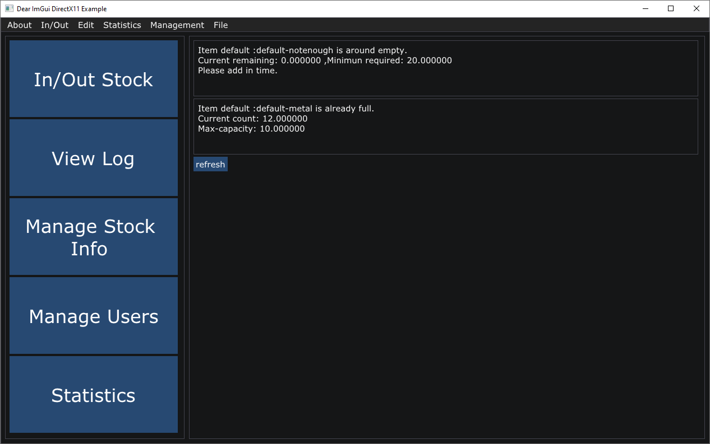
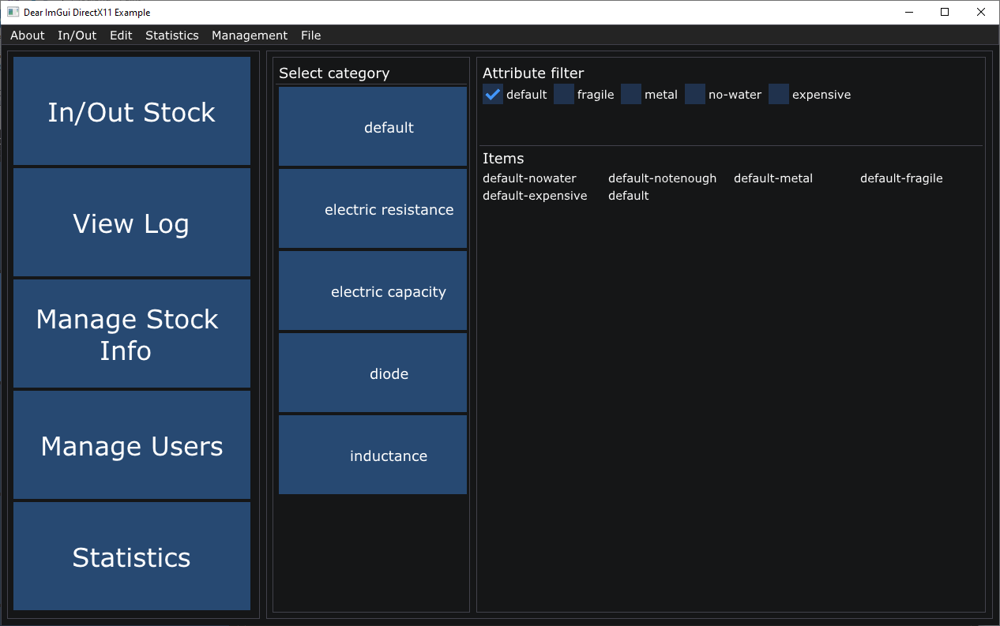
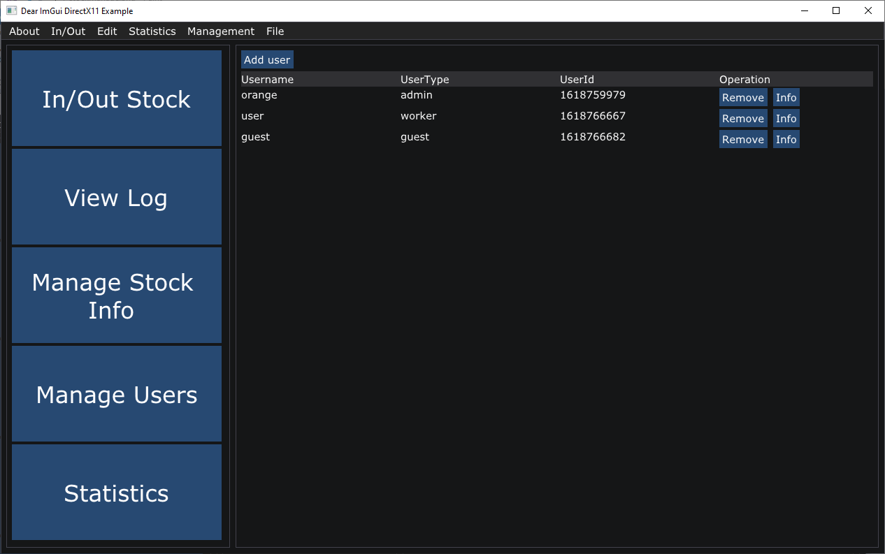
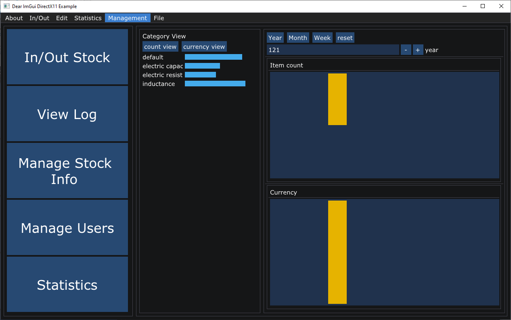

# 工程概论大作业-电子元器件仓库管理系统

### 作者 20200140班 林嘉颖，龚子健

## 设计思路

+ 实现用户登录、权限控制系统，共分为三种用户，游客(guest)，操作员(worker)，管理员。不同用户的权限不同，游客仅可查看库存概览(statistics)，操作员可以管理货物信息、出库、入库；在此基础上，管理员可以查看系统日志，管理各个账户信息。
+ 基本实现前后端分离，将数据管理的各个函数包装成一个类，暴露各种接口函数，由前端界面调用。
+ 实现数据保存系统，可以保存数据，复制、转移。（数据文件是stock_data.dat）
+ 实现日志系统，为保证安全性，每一条造作均将被记录在日志中。（日志文件是log_data.dat）

## 架构

+ 开发环境：Visual studio (Windows , C++)
+ 前端：[dear-imgui](https://github.com/ocornut/imgui)，一个开源的immediate GUI C++库，支持directx,opengl,webgl等等渲染方法。 
+ 后端：自己写的，StockMan类。
+ 每个货物具有的属性：
  + 名称
  + 描述（可选）
  + 价格
  + 类别
  + 具有的属性（易碎、金属、不可见水等等）
  + 最大库存
  + 最小库存
  + 当前库存
  + 每一笔出/入库的记录
+ 每个类别(category)具有的属性：
  + 名称
  + 描述（可选）
+ 每个属性(attribute)具有的属性：
  + 名称
  + 描述（可选）
+ 每个用户(user)具有的属性：
  + 用户名
  + 密码
  + 描述（可选）
  + 创建时间

##  使用方法

+ 登录：
  + 目前内置了三个账户:orange(管理员) user(操作员) guest(游客)。
  + 密码分别是:orange,user,guest.
  + 在登录界面输入账户密码，点击Login按钮，若账户正确，即可进入主界面。
+ 主界面功能：
  + overview界面：刚登陆之后展示的界面。也可通过顶部菜单栏Statistics->overview进入。展示了库存不足、库存过多的商品信息。
  + 点击左侧的In/Out Stock，进入**出入库**界面。选择要进行操作的货物，然后输出数量（正数为入库，负数为出库），点击confirm按钮完成操作。**该操作需要至少worker权限。**
  + 点击左侧View Log，进入**日志查看**界面。**该操作需要admin权限。**
  + 点击左侧Manage Stock Info，进入**库存管理**界面。
    + 库存管理界面分为两栏：左侧是种类选择，右键任意种类可以编辑当前种类信息或者添加/删除种类。
    + 右侧上部分是属性选择器。货物具有不同的属性（右键点击任一属性，可以添加属性或者删除当前属性），通过属性选择器筛选展示。
    + 右下部分是当前分类下，具有当前所选属性的全部货物种类。若属性选择器为空，则显示当前种类的全部货物种类。右键点击任一货物，弹出菜单，可以浏览该货物详细信息、删除该货物、出/入库、添加具有当前勾选属性的新货物。
  + 点击左侧Manage Users，进入**用户管理**界面。**需要权限：admin**。点击右侧remove删除用户，info查看用户详细信息。
  + 点击左侧Statistics，进入**数据统计**界面。
    + 左侧是所选时间段数据 按照类别的展示，点击count view展示数量数据，点击currency view 展示金钱数据。
    + 右侧上方是时间段选择器。可以按年展示（展示12个月），按月展示（展示30天），按周展示（展示7天）。右侧下方两幅柱状图，一副展示了数量数据，另一幅展示金钱数据。

## 测试方案

+ **货物信息测试**：

  + 随机生成50个字符串作为类别名称，并生成相应的：

    + 描述（随机字符串）

    依次添加进去，测试每个类别是否能添加物品、显示类别信息、正确删除。

  + 随即生成20个字符串作为属性名，并生成相应的：

    + 描述（随机字符串）

    依次添加进去，测试每个属性能否被正常删除。

  + 随机生成200个字符串作为货物名称，并生成相应的：

    + 描述（随机字符串）
    + 价格（1~100.0）随机浮点数
    + 最小库存限制：10~20 整数
    + 最大库存限制：500~1000 整数
    + 属性：从已有的属性中任意选取非零个
    + 类别：从已有的类别中任意选取一个

    依次添加到库存中，测试货物信息是否显示正确，是否能能够被正常删除。

+ **出/入库存+统计测试：**

  + 从已有的200个物品中任选一个，入库数量为-100~500之间的随机数，入库时间为2020.1.1~2021.4.1之间的随机数，重复模拟入库操作1000次。
  + 重复上述操作三次，每次结束之后：
    + 打开overview界面，查看是否有对应的信息。
    + 打开statistics界面，依次选择2020.1.1~2021.4.1之间的不同时间区间，查看统计信息是否正确。

+ **用户管理测试：**

  + 随机生成20个用户，其中5个guest,10个worker,5个admin。对各个用户进行如下操作：
    + 登陆前测试：依次点击顶部菜单栏的各个条目，查看是否被限制。
    + 登陆测试：分别输入正确的用户名，正确的密码；正确的用户名，错误的密码；错误的用户名，正确的密码；错误的用户名，错误的密码，查看结果是否正确。
    + 权限测试：依次点击左边各个功能按钮，查看权限是否受到对应的限制。
  + 删除上述20个用户，重复上述步骤3次。

+ **文件保存测试：**

  完成上述测试后，点击菜单栏save and exit，再次打开程序，查看数据是否和关闭时一样。

## Build Instructions

打开StockMan_Solution.sln **(VS 2019  required)**，任选一个配置，直接build即可。

如果找不到头文件，进入项目设置-> VC++ Directories,添加目录

+ .\imgui
+ .\headers

即可。